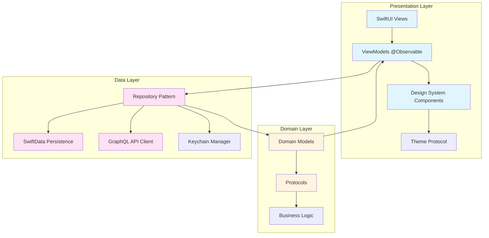
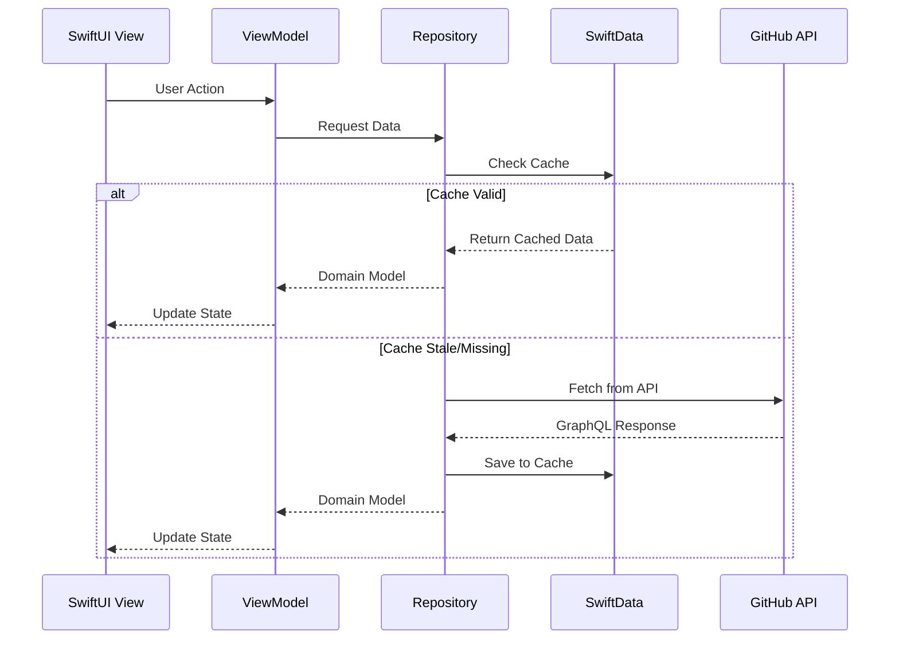
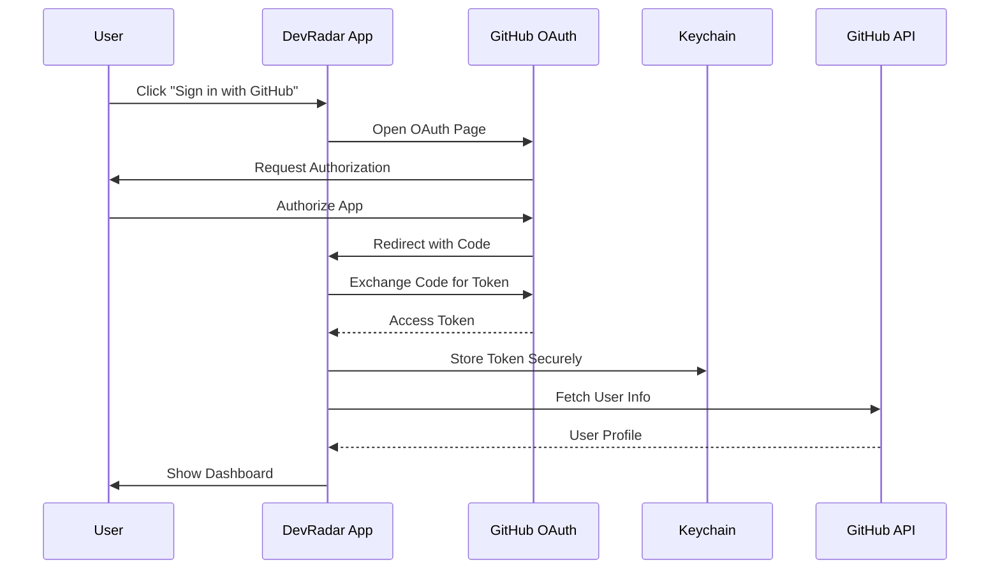
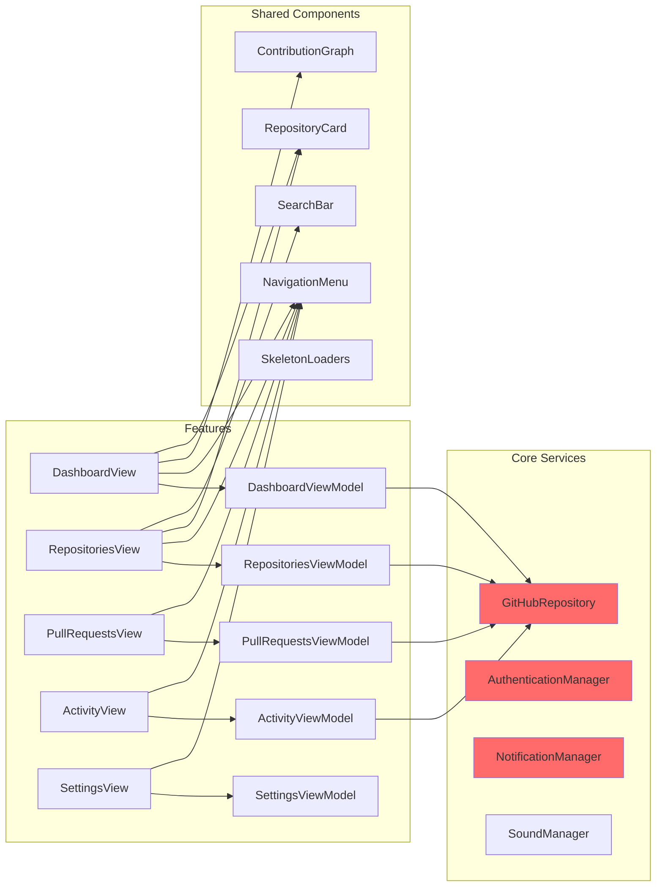
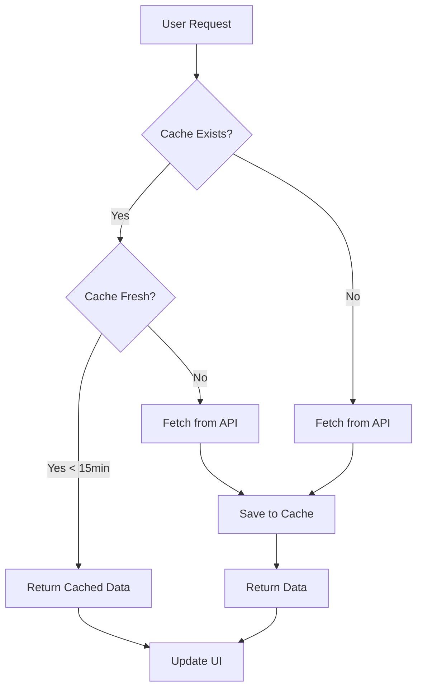
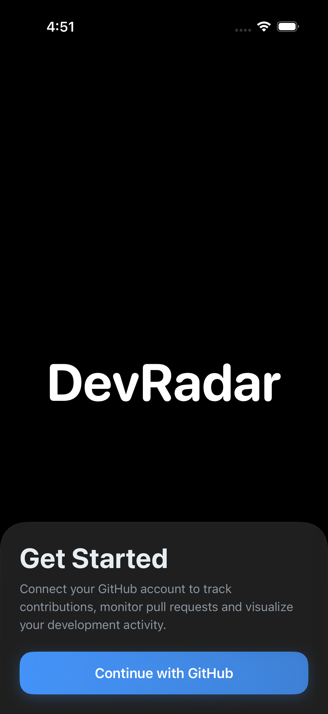
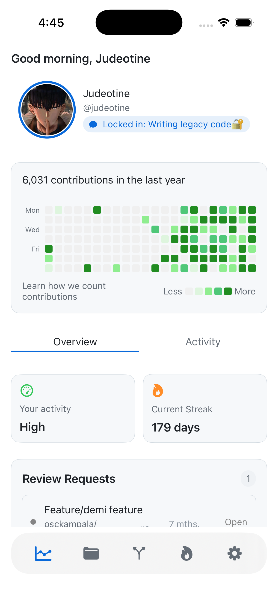
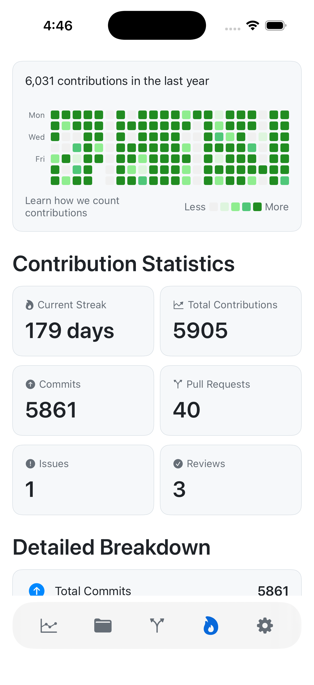
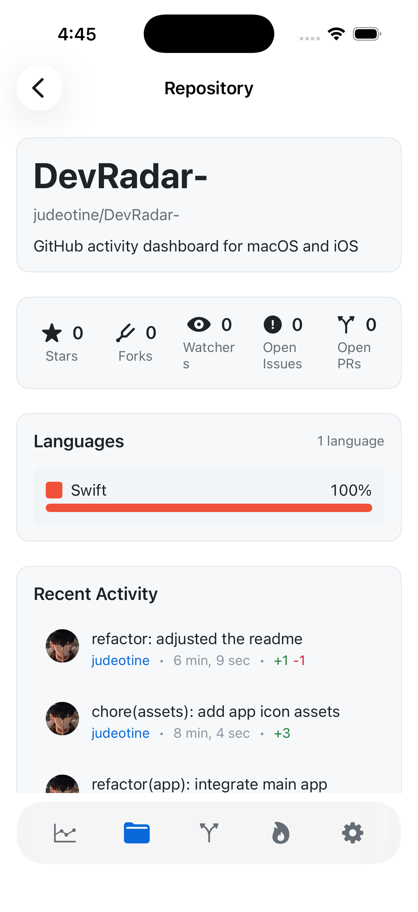
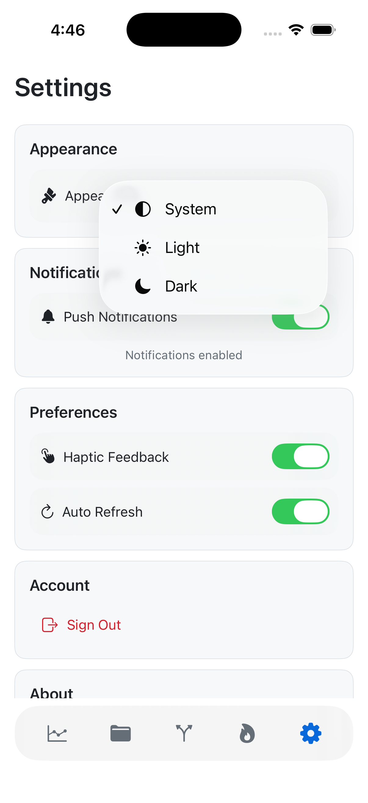

# DevRadar

<div align="center">

**A professional-grade GitHub activity dashboard for iOS and macOS**

Track contributions, monitor pull requests and visualize your development activity with a native, polished interface.

[](https://swift.org)
[](https://developer.apple.com/ios/)
[](https://developer.apple.com/macos/)
[](LICENSE)

</div>

---

## Features

- **OAuth Authentication**: Secure GitHub OAuth 2.0 flow with Keychain storage
- **Real-time Dashboard**: Live GitHub activity tracking with contribution stats and heatmap
- **Smart Caching**: SwiftData-powered offline support with 15-minute TTL
- **Pull Request Management**: Monitor PRs, review requests, and status changes
- **Repository Insights**: Browse repositories with language breakdowns, stats, and commit history
- **Native Design**: Follows platform conventions with pixel-perfect UI and liquid glass effects
- **Dark Mode**: Full support for light and dark themes with system preference detection
- **Push Notifications**: Configurable notifications for review requests and PR updates
- **Responsive UI**: Dynamic Type support and adaptive layouts for all screen sizes

## Architecture

DevRadar follows **Clean Architecture** principles with clear separation of concerns across three distinct layers. This architecture ensures maintainability, testability, and scalability.

### Architecture Overview



### Data Flow Architecture



### Authentication Flow



### Component Interaction



### Layer Breakdown

#### Presentation Layer
- **SwiftUI Views**: Declarative UI components for all screens
- **ViewModels (@Observable)**: State management with modern Swift concurrency
- **Design System**: Reusable components, theme protocol, and responsive utilities
- **Navigation**: Tab-based navigation with smooth transitions

#### Domain Layer
- **Pure Swift Models**: `User`, `Repository`, `PullRequest` - business entities
- **Protocols**: `GitHubRepositoryProtocol` for dependency injection
- **Business Logic**: Data transformations and validation rules
- **No Dependencies**: Domain layer is framework-agnostic

#### Data Layer
- **Repository Pattern**: `GitHubRepository` implements domain protocols
- **SwiftData Persistence**: Local caching with automatic migrations
- **GraphQL Client**: Type-safe API communication
- **Keychain Manager**: Secure credential storage

## Project Structure

```
DevRadar/
├── Core/                          # Core infrastructure
│   ├── Networking/
│   │   ├── GitHubAPI.swift        # GraphQL client implementation
│   │   ├── GraphQLQueries.swift   # Query definitions
│   │   └── NetworkError.swift    # Error types
│   ├── Security/
│   │   └── KeychainManager.swift  # Secure token storage
│   ├── Configuration/
│   │   ├── GitHubConfig.swift     # OAuth configuration
│   │   └── GitHubConfig.plist     # Credentials (gitignored)
│   ├── Notifications/
│   │   └── NotificationManager.swift
│   └── Utils/
│       └── SoundManager.swift     # System sound effects
│
├── Domain/                         # Business logic layer
│   └── Models/
│       ├── User.swift             # User domain model
│       ├── Repository.swift       # Repository domain model
│       ├── PullRequest.swift      # PR domain model
│       └── GraphQLResponses.swift # Response wrappers
│
├── Data/                           # Data access layer
│   ├── Persistence/
│   │   ├── CachedUser.swift       # SwiftData user model
│   │   ├── CachedRepository.swift # SwiftData repo model
│   │   ├── CachedPullRequest.swift # SwiftData PR model
│   │   ├── CachedContributionCalendar.swift
│   │   ├── CachedContributionWeek.swift
│   │   └── CachedContributionDay.swift
│   └── Repositories/
│       └── GitHubRepository.swift # Repository implementation
│
├── Features/                       # Feature modules
│   ├── Authentication/
│   │   ├── AuthenticationManager.swift
│   │   ├── AuthenticationView.swift
│   │   └── AuthenticationViewModel.swift
│   ├── Dashboard/
│   │   ├── DashboardView.swift
│   │   └── DashboardViewModel.swift
│   ├── Repositories/
│   │   ├── RepositoriesView.swift
│   │   ├── RepositoriesViewModel.swift
│   │   ├── RepositoryDetailView.swift
│   │   └── RepositoryDetailViewModel.swift
│   ├── PullRequests/
│   │   ├── PullRequestsView.swift
│   │   ├── PullRequestsViewModel.swift
│   │   └── PullRequestDetailView.swift
│   ├── Activity/
│   │   ├── ActivityView.swift
│   │   └── ActivityViewModel.swift
│   └── Settings/
│       └── SettingsView.swift
│
├── DesignSystem/                   # UI components
│   ├── Theme.swift                 # Theme protocol & tokens
│   ├── Components/
│   │   ├── NavigationMenu.swift
│   │   ├── ContributionGraph.swift
│   │   ├── RepositoryCard.swift
│   │   ├── ProfileHeader.swift
│   │   ├── GitHubStatsCard.swift
│   │   ├── SearchBar.swift
│   │   ├── SkeletonLoaders.swift
│   │   └── ... (20+ components)
│   └── Utils/
│       └── Greeting.swift
│
└── DevRadarApp.swift              # App entry point
```

## Setup

### Prerequisites

- **Xcode 15.0+** (with Swift 5.9+)
- **macOS 14.0+** (for development)
- **iOS 17.0+** (target platform)
- **GitHub OAuth App** credentials

### 1. Clone the Repository

```bash
git clone https://github.com/judeotine/DevRadar-.git
cd DevRadar-
```

### 2. Create GitHub OAuth App

1. Go to [GitHub Settings → Developer settings → OAuth Apps](https://github.com/settings/developers)
2. Click **"New OAuth App"**
3. Fill in the details:
   - **Application name**: `DevRadar`
   - **Homepage URL**: `https://github.com/judeotine/DevRadar-`
   - **Authorization callback URL**: `devradar://oauth-callback`
4. Click **"Register application"**
5. Copy your **Client ID** and **Client Secret**

### 3. Configure Credentials

Create a `GitHubConfig.plist` file in `DevRadar/Core/Configuration/`:

```xml
<?xml version="1.0" encoding="UTF-8"?>
<!DOCTYPE plist PUBLIC "-//Apple//DTD PLIST 1.0//EN" "http://www.apple.com/DTDs/PropertyList-1.0.dtd">
<plist version="1.0">
<dict>
    <key>ClientID</key>
    <string>YOUR_CLIENT_ID</string>
    <key>ClientSecret</key>
    <string>YOUR_CLIENT_SECRET</string>
</dict>
</plist>
```

> **Note**: The `GitHubConfig.plist` file is gitignored. Never commit your credentials to version control.

### 4. Configure URL Scheme

1. Open `DevRadar.xcodeproj` in Xcode
2. Select the **DevRadar** target
3. Go to **Info** tab
4. Expand **"URL Types"**
5. Add a new URL Type:
   - **Identifier**: `com.devradar.oauth`
   - **URL Schemes**: `devradar`

### 5. Build and Run

```bash
# Open in Xcode
open DevRadar.xcodeproj

# Or build from command line
xcodebuild -scheme DevRadar -configuration Debug
```

## Technical Implementation

### Cache Strategy



**Cache Strategy Details:**
- **Cache-first approach**: Load from SwiftData immediately for instant UI
- **Background refresh**: Fetch from API if cache is stale (>15 min TTL)
- **Optimistic updates**: UI updates before network confirmation
- **Error recovery**: Fall back to cache on network errors
- **Automatic invalidation**: Cache expires after 15 minutes

### GraphQL Queries

All GitHub data is fetched using GraphQL for efficiency and type safety:

- **Viewer Query**: User profile, contribution stats, and status
- **Repositories Query**: User's repositories with pagination support
- **Pull Requests Query**: User's PRs with review state and metadata
- **Review Requests Query**: PRs awaiting user review
- **Repository Details Query**: Detailed repo info, commits, branches, and collaborators

### Design System

#### Semantic Colors
- **Primary**: GitHub blue (#0969DA light, #4493F8 dark)
- **Success**: Green for approved/merged states
- **Warning**: Yellow for pending/draft states
- **Error**: Red for failed/rejected states
- **Background**: Adaptive system colors with theme support

#### Typography Scale
- **Display**: 34pt bold (page titles)
- **Title**: 28pt semibold (section headers)
- **Headline**: 17pt semibold (card titles)
- **Body**: 15pt regular (content)
- **Caption**: 13pt regular (metadata)
- **Code**: 14pt monospaced (code snippets)

#### Spacing System
4pt grid system: `4, 8, 12, 16, 24, 32, 48, 64`

#### Animations
- **Spring transitions**: `response: 0.3, dampingFraction: 0.7`
- **Content transitions**: Smooth fade and slide animations
- **Skeleton loading**: Shimmer effect for loading states
- **Haptic feedback**: Light impact feedback for interactions

## Screenshots

### Authentication Screen

The app features a minimalist authentication screen with a black background showcasing the DevRadar branding and a modern "Get Started" modal with liquid glass effects.



### Dashboard - Overview

The main dashboard displays a personalized greeting, user profile with status, contribution heatmap showing yearly activity, and key metrics including activity level and current streak.



### Dashboard - Activity

The activity tab provides detailed contribution statistics including current streak, total contributions, commits, pull requests, issues, and reviews in an organized card layout.



### Repository Detail

Detailed repository view showing repository information, statistics (stars, forks, watchers, issues, PRs), language breakdown, and recent commit activity.



### Settings

Comprehensive settings screen with appearance customization (System/Light/Dark themes), push notifications toggle, preferences for haptic feedback and auto-refresh, and account management options.



## Roadmap

### Planned Features

- [ ] **Repository Details**
  - [ ] Commit timeline visualization
  - [ ] Branch comparison view
  - [ ] File tree browser
  - [ ] Issue tracking integration

- [ ] **Enhanced Analytics**
  - [ ] Contribution streak tracking
  - [ ] Language usage trends
  - [ ] Activity heatmap improvements
  - [ ] Export statistics

- [ ] **Platform Expansion**
  - [ ] macOS MenuBar app
  - [ ] iOS widgets for Home Screen
  - [ ] Background sync with BackgroundTasks

- [ ] **Collaboration**
  - [ ] Team activity dashboard
  - [ ] Organization insights
  - [ ] PR review reminders
  - [ ] Code review suggestions

### Technical Improvements

- [ ] Unit tests for ViewModels
- [ ] Integration tests for API layer
- [ ] UI snapshot tests
- [ ] Performance profiling and optimization
- [ ] Accessibility improvements
- [ ] Localization support

## Contributing

This is currently a solo project, but suggestions and feedback are welcome!

### How to Contribute

1. **Fork the repository**
2. **Create a feature branch** (`git checkout -b feature/amazing-feature`)
3. **Make your changes** following the existing code style
4. **Commit your changes** (`git commit -m 'feat: add amazing feature'`)
5. **Push to the branch** (`git push origin feature/amazing-feature`)
6. **Open a Pull Request**

### Code Style

- Follow Swift API Design Guidelines
- Use meaningful variable and function names
- Add comments for complex logic
- Keep functions focused and small
- Write self-documenting code

## License

This is a portfolio project. Feel free to use as inspiration for your own projects.

## Author

**Jude Otine**

- GitHub: [@judeotine](https://github.com/judeotine)
- Repository: [DevRadar](https://github.com/judeotine/DevRadar-)


